

  

<h3 align="center">🎯IT Student. Aspiring Full-Stack & Front-End Developer — passionate about building clean, efficient, and user-friendly web applications. Based in Butuan City, Agusan del Norte, Northern Mindanao, Philippines. 🇵🇭</h3>

 

About Me

I love turning ideas into clean, functional, and user-friendly web applications. Whether it’s building responsive interfaces, writing backend logic, or experimenting with new technologies — I’m always excited to learn, create, and grow as a developer.  
💡 Always building. Always learning. Always improving.

 

🚀 What I Do / What I’m Learning

  
💻 Skilled in HTML, CSS, JavaScript, PHP (Laravel), MySQL, TailwindCSS, Bootstrap, Chart.js, and building Flutter mobile apps. 
🔧 Currently working on a Hotel Booking System, a Flutter Chili Pepper Test App, and AgriConnect for product–demand matching. 
🌱 Always learning modern frameworks, clean architecture, and best practices. 
📚 Passionate about web development, scalable systems, and writing clean, maintainable code.

<h3 align="center">Skills</h3>
## 🧠 Programming Languages

## 🎨 Frontend

## 🗄️ Backend & Database

## 📱 Mobile Development

## 🛠️ Tools & Version Control

 ## 🌶️ Chili Pepper Identifier – Flutter Application

**Chili Pepper Identifier** is a cross-platform mobile app built with **Flutter** that detects and classifies various chili pepper types using **image recognition technology**. Powered by **TensorFlow Lite**, it performs **real-time image classification on-device**, eliminating the need for constant internet connectivity.  

---

### 📸 Image Input Methods
Users can provide images through **two main methods**:

- **Camera Capture** – Take photos in real-time using the device camera.
- **Gallery Selection** – Select existing images from the device’s gallery.

The app processes images using a **pre-trained ML model** stored in the `assets/tflite` directory:

| File | Purpose |
|------|---------|
| `model_unquant.tflite` | Machine learning model for inference |
| `labels.txt` | List of classification categories |

**Detection results** include the identified chili pepper type and **confidence percentage**, displayed with clear visual feedback.

---

### ☁️ Data Persistence & History Tracking
The app ensures **robust data storage** and history tracking using a **dual approach**:

- **Cloud Storage** – Firebase Realtime Database for history tracking and cloud backup.
- **Local Storage** – SharedPreferences for offline access and protection against network failures.

---

### 🎨 User Interface
- **Vibrant color scheme** – Green & red gradients reflecting chili pepper theme 🌶️  
- **Responsive design** – Widgets adapt to various screen sizes and orientations  
- **Intuitive navigation**:
  - **Landing page** – Introduces the app  
  - **Camera interface** – Performs real-time image processing  
  - **Results page** – Displays chronological list of past detections with timestamps  

---

### ⚙️ Architecture & Functionality
- **Flutter State Management** – StatefulWidgets for dynamic UI updates  
- **Separation of Concerns** – Each feature in a distinct file for maintainability  
- **Error Handling** – Handles camera initialization failures, model loading errors, and network issues  
- **Permissions Management** – Requests camera and storage permissions seamlessly  

---

### 🚀 Highlights
- Real-time on-device chili pepper classification  
- Dual storage: Cloud (Firebase) + Local (SharedPreferences)  
- Colorful and responsive UI with intuitive navigation  
- Handles errors and permissions gracefully  

## 📱 Application Screenshots

| Homepage | Guide Popup | Scanner Page | Profile Page|
|----------|--------------|-----------------|-----------------|
|  |  | 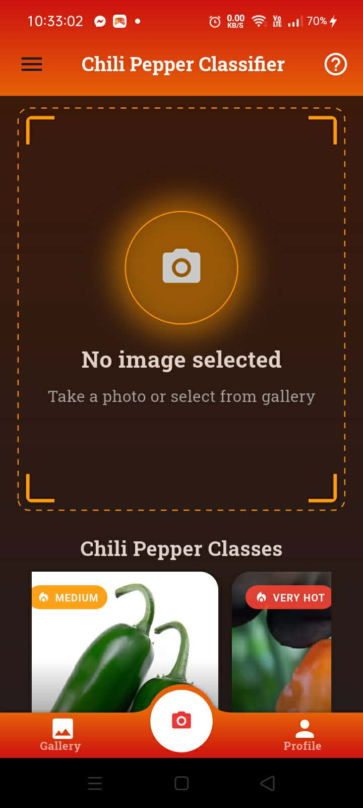|  |

| Chili Pepper Details| Prediction Result |
|-----------------|------------------------------------|
|  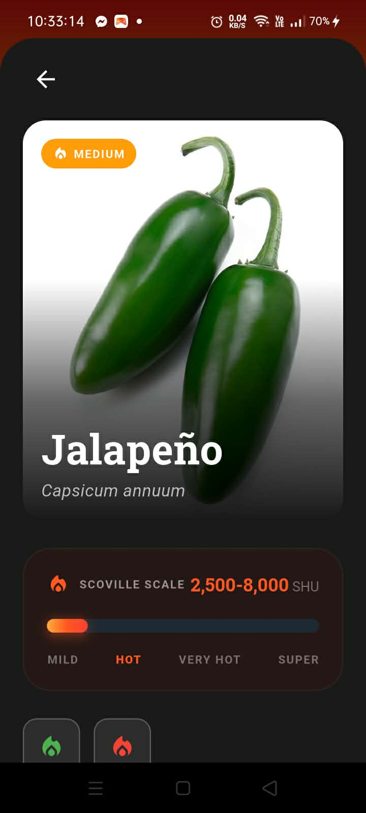 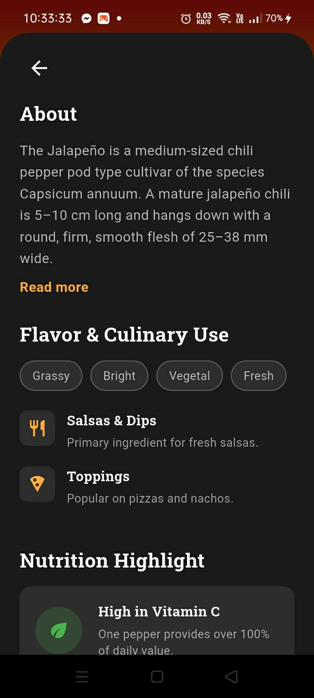 | 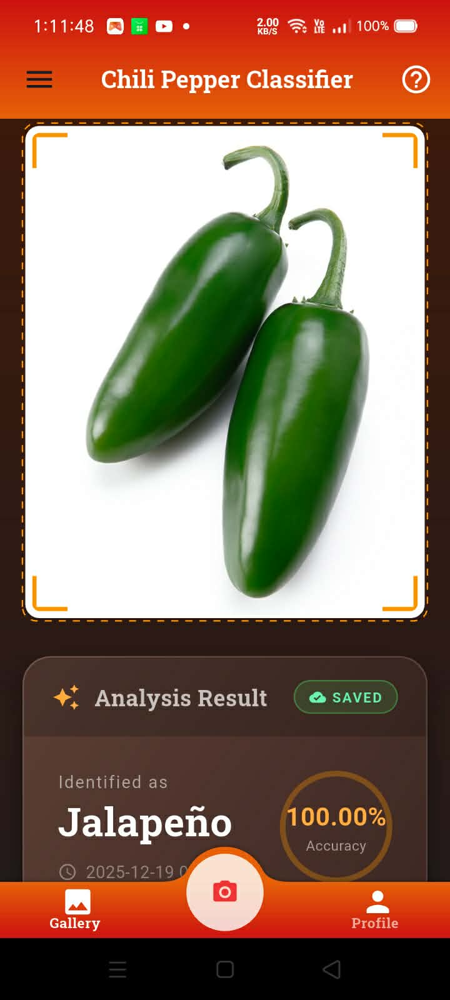 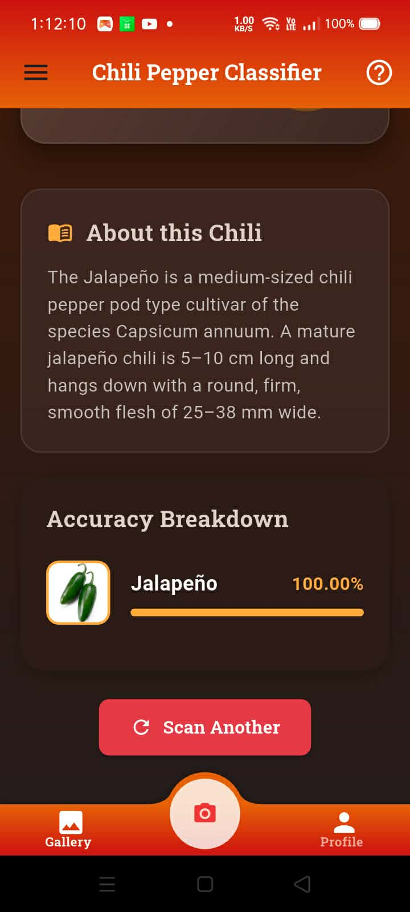 |

| Navigation Drawer | History Page & History Prediction View | Analytics Page |
|-----------------------|----------------------|----------------------|
| 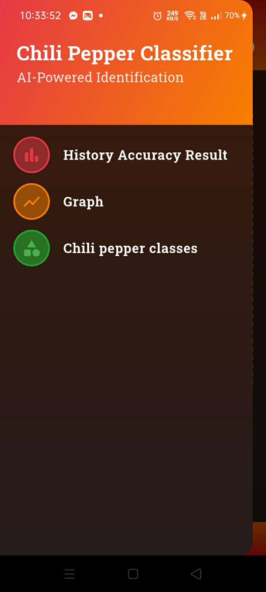 | 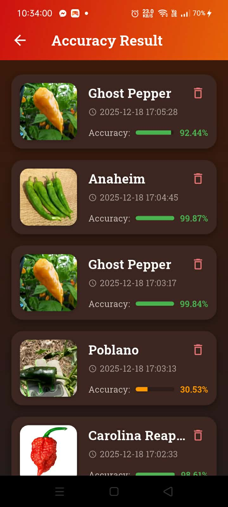 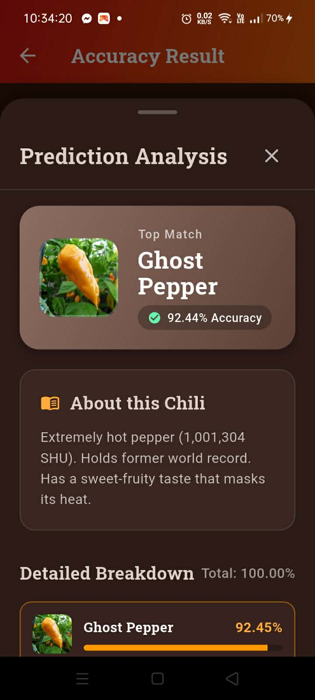 | 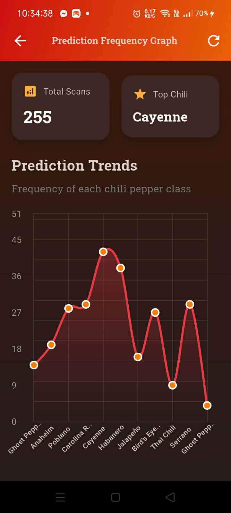 |

|  Chili Pepper List & Full Description |
|-----------------------|
|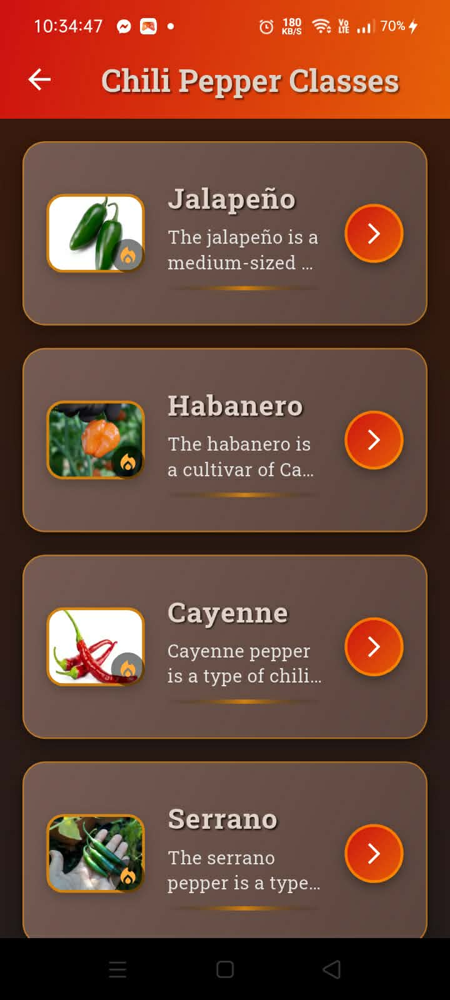 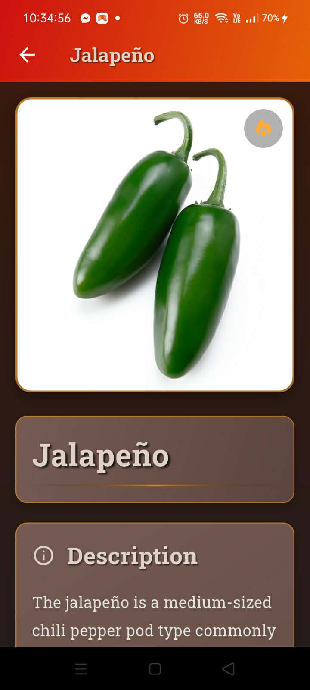 |

## 🌶️ Chili Pepper Varieties

| Class Pepper | Preview | Description |
|--------------|---------|------------|
| Anaheim |  | Mild chili with a slightly sweet flavor, often used in Mexican dishes. |
| Bird's Eye Chili |  | Small and extremely hot chili, common in Southeast Asian cuisine. |
| Carolina Reaper |  | One of the hottest peppers in the world, fruity and spicy. |
| Cayenne |  | Medium-hot chili, used dried or powdered in cooking. |
| Ghost Pepper |  | Extremely hot chili, also known as Bhut Jolokia. |
| Habanero |  | Very hot chili, fruity flavor, popular in hot sauces. |
| Jalapeno |  | Mild to medium heat, widely used in Mexican cuisine. |
| Poblano |  | Mild chili, often roasted and used in sauces and stuffing. |
| Serrano | 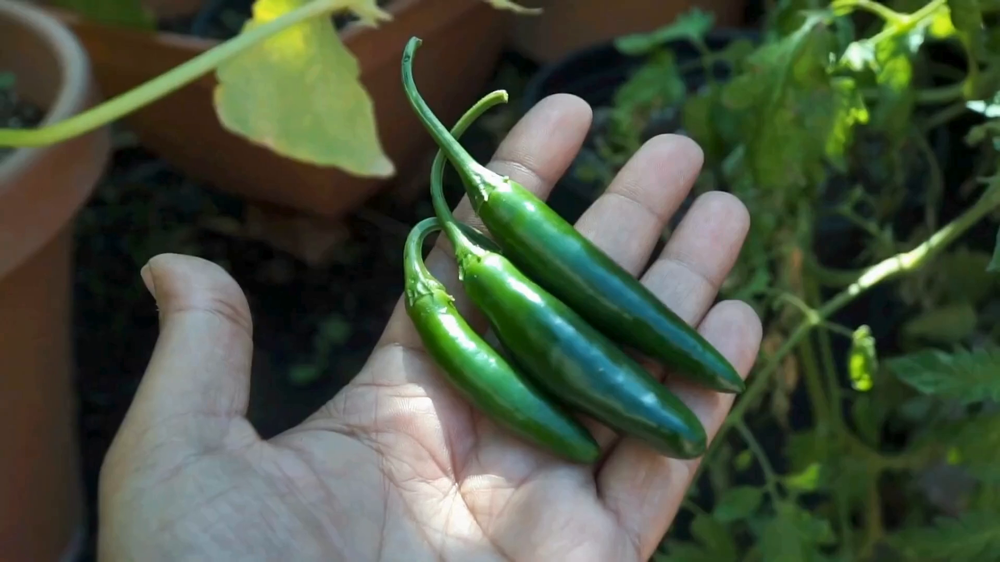 | Medium-hot chili, sharper than jalapeno, used in salsas. |
| Thai Chili |  | Small, very hot chili, common in Thai cuisine. |

## 📂 Highlighted Projects
| Project | Description |
|--------|-------------|
| **Example-of-Git-and-Github** | Starter repo for Git/GitHub basics — version control, branching, committing. |
| **Umpad_IT200_Act1** | Python project — exercises and assignments. |
| **Umpad_IT108_Activities** | School activities/projects in different languages. |
| **Flutter_Widget_UIComponents** | Flutter UI components showcase. |
| **Pick-and-Match-** | CSS project — styling & responsive design practice. |
| **Flutter_Projects** | Flutter & Dart experiments. |

<h3>Profile Stats</h3><!-- First row: 2 images -->

  
  

<!-- Second row: 3 images -->

  
  
  

<!-- <picture>
  <source media="(prefers-color-scheme: dark)" srcset="https://raw.githubusercontent.com/jerwil445/jerwil445/output/pacman-contribution-graph-dark.svg">
  <source media="(prefers-color-scheme: light)" srcset="https://raw.githubusercontent.com/jerwil445/jerwil445/output/pacman-contribution-graph.svg">
  
</picture> -->
